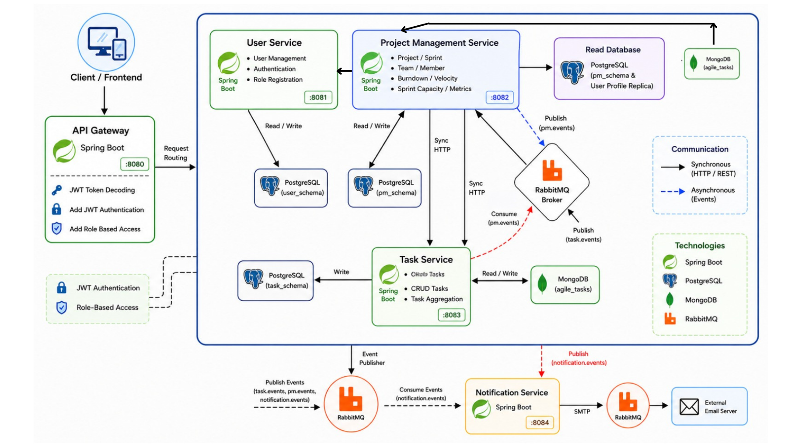
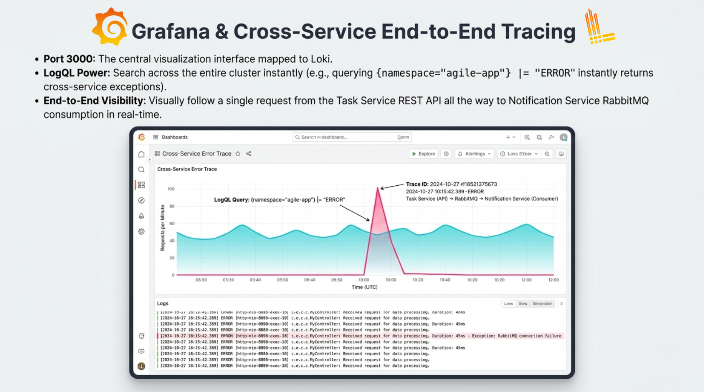
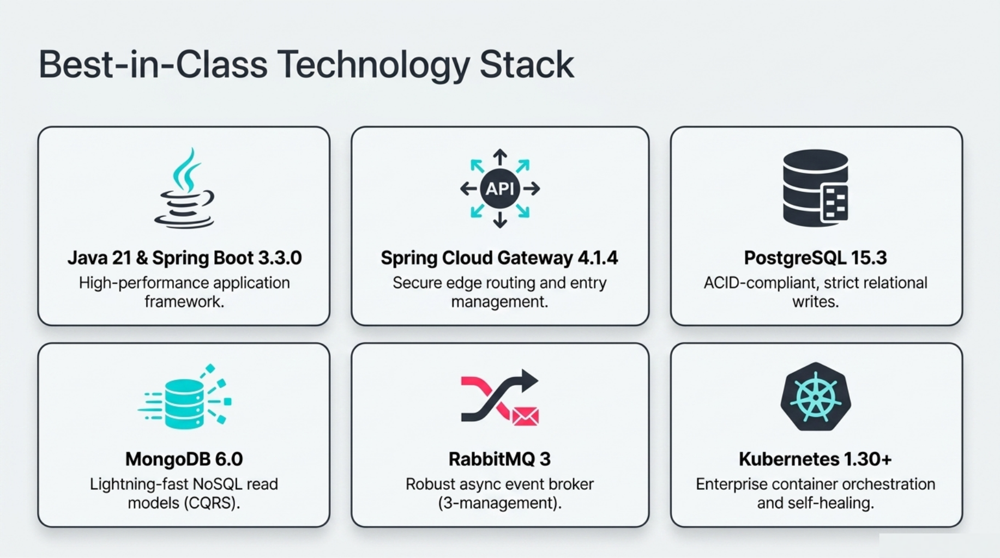

# Agile Microservices Platform

<p align="center">
  <strong>A distributed Agile workspace for project planning, sprint execution, task management, team capacity, and event-driven notifications.</strong>
</p>

<p align="center">
  
  
  
  
  
</p>

## Overview

Agile Microservices is a collaborative project-management platform designed around independent services and clear domain boundaries. It provides a complete workflow for Agile teams: users authenticate through a central gateway, create projects, organize work into sprints, assign and track tasks, monitor capacity, and receive asynchronous notifications when important events occur.

The platform combines synchronous REST APIs for operations that require an immediate response with asynchronous RabbitMQ events for cross-service communication. PostgreSQL is used for transactional data, while MongoDB read models support fast queries and metrics such as sprint burndown and project velocity.

## Why this project matters

This project demonstrates how to design and operate a real-world distributed system rather than a collection of isolated CRUD services. Its main engineering concerns include:

- Service decomposition around user, project, task, gateway, and notification domains.
- Centralized authentication and authorization at the API boundary using JWTs and role-based access control.
- Database-per-service boundaries with dedicated PostgreSQL schemas.
- CQRS-inspired read models in MongoDB for analytics and authorization lookups.
- Event-driven workflows through RabbitMQ exchanges and consumers.
- Containerized local development with Docker Compose.
- Kubernetes manifests, namespace isolation, secrets, persistent storage, services, and ingress configuration.
- API discoverability through centralized Swagger/OpenAPI documentation.

## Architecture

The client communicates with the API Gateway, which validates access tokens and routes requests to the appropriate bounded context. The Project Management and Task services communicate through both HTTP and events, while the Notification Service consumes events in the background and sends email notifications through SMTP.



### Services

| Service | Port | Responsibility |
|---|---:|---|
| API Gateway | `8080` | Single entry point, routing, JWT decoding, role-based access checks, and Swagger aggregation. |
| User Service | `8081` | Registration, authentication, user profiles, password handling, and roles. |
| Project Management Service | `8082` | Projects, sprints, team membership, sprint capacity, burndown, and velocity metrics. |
| Task Service | `8083` | Task creation, assignment, status transitions, sprint assignment, and project-level authorization. |
| Notification Service | `8084` | Headless RabbitMQ consumer that processes notification events and sends email alerts. |
| React Frontend | `5173` | Web interface for authentication, project management, backlog planning, sprints, and task boards. |

## Core workflows

### Authentication and authorization

1. A user registers or signs in through the User Service.
2. The service issues a JWT-based access token.
3. Requests pass through the API Gateway.
4. The gateway validates the token and forwards identity and role information to downstream services.
5. Each service applies its own domain-level authorization rules.

### Project and sprint planning

Product owners can create Agile projects, select a methodology such as Scrum, Kanban, or Hybrid, invite team members, create sprints, and define sprint capacity. The Project Management Service maintains project and sprint state and exposes metrics for planning and review.

### Task execution

Tasks can be created, assigned to developers, placed in a sprint, and moved through their lifecycle. The Task Service remains the source of truth for task data and publishes events whenever task state changes.

### Event-driven notifications

RabbitMQ decouples services that do not need to block the original request. Examples include:

- Task events consumed by the Project Management Service to update read models.
- Project-membership events consumed by the Task Service for fast access checks.
- Capacity and overload events consumed by the Notification Service for email alerts.

This approach keeps synchronous APIs responsive while allowing background consumers to process secondary actions independently.

## Data and consistency model

The platform uses separate persistence responsibilities for each service:

- **PostgreSQL** stores authoritative transactional data for users, projects, sprints, and tasks.
- **MongoDB** stores read-oriented projections used for analytics and fast cross-service lookups.
- **RabbitMQ** transports domain events between services and supports eventual consistency.
- **CQRS-inspired projections** allow reporting queries to remain independent from transactional write models.

## Observability and operations

The project documentation includes a Grafana/Loki-style observability view for following a request across service boundaries, searching centralized logs, and identifying failures in asynchronous flows such as Task Service -> RabbitMQ -> Notification Service.



The `k8s/` directory contains the operational deployment layer, including:

- Isolated `agile-app` namespace.
- ConfigMaps and Kubernetes Secrets.
- PostgreSQL, MongoDB, and RabbitMQ StatefulSets.
- Deployments and Services for the application microservices.
- Nginx Ingress routing for the API Gateway.
- Deployment and teardown scripts.
- Readiness and liveness configuration for stateful infrastructure.

## Technology stack



| Layer | Technologies |
|---|---|
| Backend | Java 21, Spring Boot, Spring MVC, Spring WebFlux, Spring Security |
| Gateway | Spring Cloud Gateway, JWT/JJWT, centralized routing and authorization |
| Persistence | PostgreSQL, MongoDB, Spring Data JPA, Spring Data MongoDB |
| Messaging | RabbitMQ, Spring AMQP, domain events, asynchronous consumers |
| Frontend | React, TypeScript, Vite, React Router, Tailwind CSS |
| API documentation | OpenAPI and Swagger UI |
| Packaging | Maven, Docker, multi-stage Dockerfiles |
| Orchestration | Kubernetes, StatefulSets, Deployments, Services, ConfigMaps, Secrets, and Ingress |

## Getting started with Docker Compose

### Prerequisites

- Docker Desktop with Docker Compose.
- Node.js and npm if you want to run the frontend locally.
- Git.

### Start the backend platform

```bash
git clone https://github.com/BadrLaklach/Agile_Microservices.git
cd Agile_Microservices
docker compose up --build
```

The Compose stack starts PostgreSQL, MongoDB, RabbitMQ, the API Gateway, and the backend microservices. The frontend is developed separately from the Compose services:

```bash
cd frontend
npm ci
npm run dev
```

The Vite development server proxies `/api` requests to the API Gateway at `http://localhost:8080`.

### Local endpoints

| Component | URL |
|---|---|
| Frontend | http://localhost:5173 |
| API Gateway | http://localhost:8080 |
| Unified Swagger UI | http://localhost:8080/swagger-ui.html |
| RabbitMQ Management UI | http://localhost:15672 |
| PostgreSQL | `localhost:5432` |
| MongoDB | `localhost:27017` |

Stop the local environment with:

```bash
docker compose down
```

To remove the local database volumes as well, use `docker compose down -v`. This deletes locally persisted development data.

## API exploration

The repository includes guides for testing the full platform lifecycle through the gateway:

- [System architecture](SYSTEM_DESIGN.md) - service responsibilities, interactions, and event flows.
- [API testing scenarios](API_TESTING_SCENARIOS.md) - registration, authentication, project creation, sprint planning, task execution, and metrics.
- [Swagger UI guide](SWAGGER_UI_GUIDE.md) - interactive OpenAPI testing through the browser.

The main workflow is:

1. Register and authenticate a user.
2. Use the returned JWT to authorize Swagger or API requests.
3. Create a project and add team members.
4. Create a sprint and define its capacity.
5. Create and assign tasks.
6. Move tasks through their lifecycle.
7. Inspect burndown, velocity, task summaries, and notification-service logs.

## Kubernetes deployment

The Kubernetes manifests are designed for local clusters such as MicroK8s or K3s. Review [`k8s/README.md`](k8s/README.md) before deploying because the manifests expect a Kubernetes cluster, an Ingress controller, local container images, and environment-specific secrets.

```bash
cd k8s
chmod +x deploy.sh
./deploy.sh
```

To inspect the deployment:

```bash
kubectl get pods -n agile-app
kubectl get services -n agile-app
```

## Repository structure

```text
.
├── api_gateway/                 # Spring Cloud Gateway and JWT edge security
├── user_service/                # Registration, authentication, and roles
├── project_management_service/  # Projects, sprints, members, and metrics
├── task_service/                # Task lifecycle and task events
├── notification_service/        # RabbitMQ consumer and email notifications
├── frontend/                    # React and TypeScript application
├── k8s/                         # Kubernetes manifests and deployment scripts
├── docs/images/                 # Architecture, observability, and stack diagrams
├── docker-compose.yml           # Local multi-service environment
├── init-db.sql                  # PostgreSQL roles and initialization
└── SYSTEM_DESIGN.md             # Detailed system design
```

## Collaboration

This repository is a fork of [eayzaid/Agile_Microservices](https://github.com/eayzaid/Agile_Microservices). The fork preserves the upstream history and branch structure, while this copy provides a personal reference point for contributions, documentation, and continued development.

## License

No license file is currently included in the repository. Review and add an appropriate license before distributing the project for reuse.
