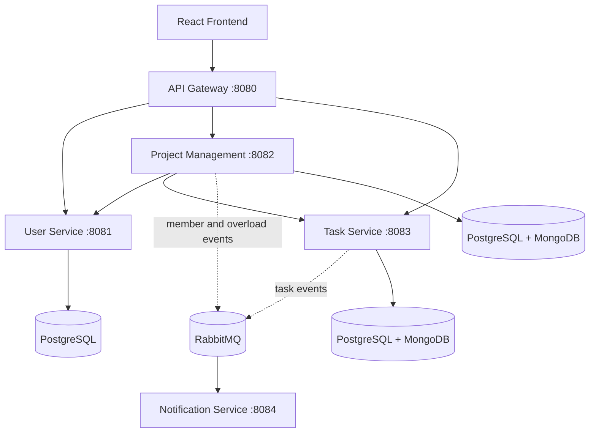

# Agile Microservices Platform

An Agile project-management workspace built as a distributed microservices platform. The system supports user authentication, project and sprint planning, task execution, team-capacity tracking, analytics, and asynchronous notifications through a unified API gateway.

## Architecture

The platform is composed of the following services:

- **API Gateway** (`:8080`) — single entry point, request routing, JWT validation, and Swagger aggregation.
- **User Service** (`:8081`) — registration, authentication, roles, and user profiles.
- **Project Management Service** (`:8082`) — projects, sprints, memberships, capacity, burndown, and velocity metrics.
- **Task Service** (`:8083`) — task lifecycle, assignment, status transitions, and project-level authorization.
- **Notification Service** (`:8084`) — asynchronous email notifications triggered by RabbitMQ events.
- **React frontend** — web interface for interacting with the Agile workspace.

The services use synchronous REST communication for operations requiring immediate consistency and RabbitMQ events for decoupled workflows. PostgreSQL stores transactional data, while MongoDB stores read models used for analytics and fast authorization checks.



## Main capabilities

- JWT-based authentication and role-based access control
- Agile project, sprint, and team-member management
- Task creation, assignment, sprint planning, and status tracking
- Sprint-capacity and developer-load monitoring
- Burndown, velocity, and task-summary metrics
- Event-driven communication with RabbitMQ
- Centralized Swagger UI through the API Gateway
- Docker Compose and Kubernetes deployment support

## Technology stack

- Java 21 and Spring Boot
- Spring Cloud Gateway
- Spring Data JPA and Spring Security
- PostgreSQL and MongoDB
- RabbitMQ
- React, TypeScript, and Vite
- Docker and Kubernetes
- OpenAPI / Swagger UI

## Run locally with Docker Compose

### Prerequisites

- Docker Desktop with Docker Compose
- Git

### Start the platform

```bash
git clone https://github.com/BadrLaklach/Agile_Microservices.git
cd Agile_Microservices
docker compose up --build
```

The main entry points are:

| Component | URL |
|---|---|
| API Gateway | http://localhost:8080 |
| Swagger UI | http://localhost:8080/swagger-ui.html |
| Frontend | http://localhost:5173 |
| RabbitMQ Management | http://localhost:15672 |

The default Docker Compose configuration is intended for local development. Replace placeholder database, JWT, SMTP, and application credentials before using the platform in a shared or production environment.

## API documentation and testing

- [System architecture](SYSTEM_DESIGN.md)
- [API testing scenarios](API_TESTING_SCENARIOS.md)
- [Swagger UI guide](SWAGGER_UI_GUIDE.md)

For Kubernetes deployments, see the manifests in [`k8s/`](k8s/).

## Repository structure

```text
├── api_gateway/
├── user_service/
├── project_management_service/
├── task_service/
├── notification_service/
├── frontend/
├── k8s/
├── docker-compose.yml
├── init-db.sql
└── SYSTEM_DESIGN.md
```

## Collaboration

This is a collaborative project. The repository preserves the upstream project history and branch structure; individual contributions can be reviewed through the commit history and feature branches.
