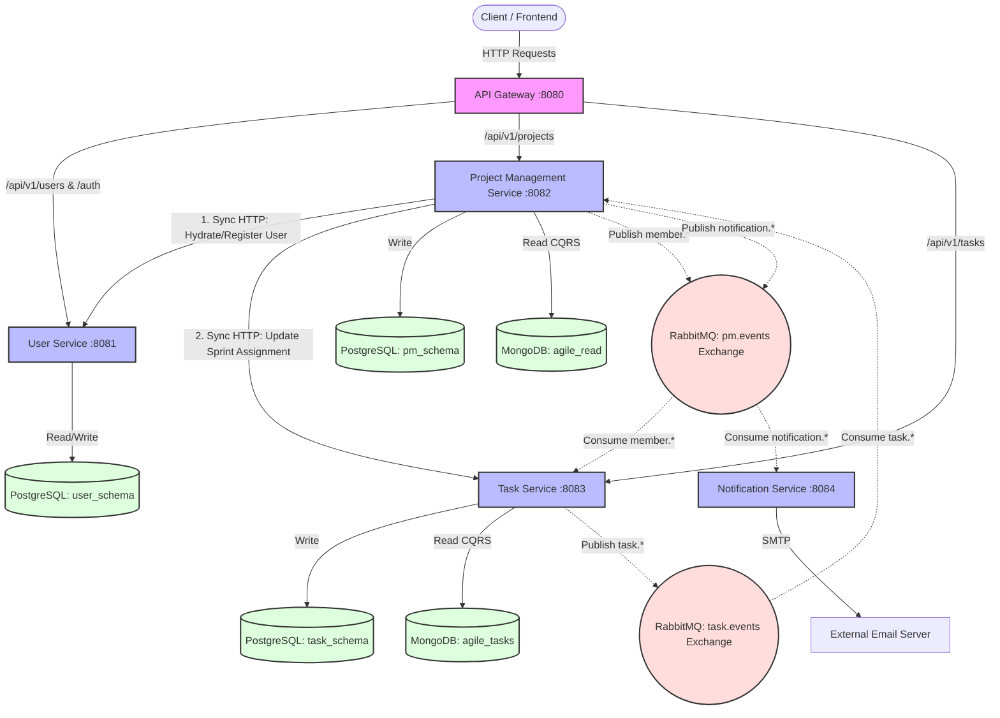

# Agile Microservices - System Architecture

This document focuses on the roles of each microservice, their interaction patterns, and provides a full architecture schema that can be visualized as an image.

## 1. Roles of Each Service

*   **API Gateway (`:8080`)**: The single entry point for clients. It acts as the security boundary, validating JWT cookies, extracting identity claims (`X-User-Id`, `X-User-Role`), and securely routing requests to the appropriate backend microservices.
*   **User Service (`:8081`)**: The Identity Provider (IdP). It manages user registration,z authentication, role assignments, and issues secure HTTP-only session tokens.
*   **Project Management (PM) Service (`:8082`)**: The core orchestrator. It manages the lifecycle of Agile projects, sprints, and team membership. It calculates metrics (burndown/velocity) and manages sprint capacity logic.
*   **Task Service (`:8083`)**: The single source of truth for task data. It manages the creation, updates, and status transitions of all tasks (Stories, Bugs) while enforcing strict project-level access controls.
*   **Notification Service (`:8084`)**: The alerting engine. A purely asynchronous background service that listens for system threshold events (like overloaded sprints) and dispatches email notifications to stakeholders.

---

## 2. Service Interactions

The microservices communicate using a hybrid model of **Synchronous HTTP** for immediate consistency and **Asynchronous messaging (RabbitMQ)** for eventual consistency and decoupling.

### Synchronous Interactions (HTTP / REST)
*   **API Gateway -> Downstream Services**: Forwards client requests with injected identity headers.
*   **PM Service -> User Service**: Fetches user profiles or dynamically registers new users on-the-fly when adding a member to an Agile project.
*   **PM Service -> Task Service**: Issues an immediate HTTP `PATCH` request to update a task's assigned sprint, ensuring the source of truth is updated before the PM service commits its local transaction.

### Asynchronous Interactions (RabbitMQ)
*   **Task Service -> PM Service (`task.events`)**: Whenever a task is created or updated, the Task Service publishes an event. The PM Service consumes this to update its local MongoDB read model, allowing it to instantly generate burndown charts.
*   **PM Service -> Task Service (`pm.events`)**: When a user is invited to or removed from a project, the PM Service publishes membership events. The Task Service consumes these to update its local MongoDB read model for fast `O(1)` authorization checks.
*   **PM Service -> Notification Service (`pm.events`)**: When the PM Service detects that a newly assigned task pushes a sprint or developer over capacity, it fires an overload event. The Notification Service consumes this and sends out an email asynchronously.

---

## 3. Architecture Schema

Below is the full system architecture schema written in Mermaid.js. You can paste this code into [Mermaid Live Editor](https://mermaid.live/) or use markdown extensions to generate an architecture diagram image.

